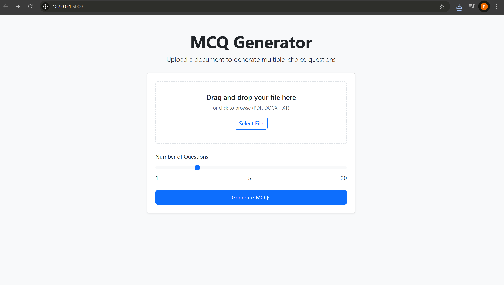

# MCQ Generator from Documents

A Flask web application that generates multiple-choice questions (MCQs) from uploaded documents (PDF, DOCX, or TXT) using LangChain and Groq's LLM.

## Features

- Upload PDF, DOCX, or TXT files
- Specify number of MCQs to generate
- View generated MCQs in both raw and parsed formats
- Download MCQs as TXT or PDF files
- Uses Groq's Llama 3 70B model for high-quality question generation

## Requirements

- Python 3.7+
- Flask
- pdfplumber
- python-docx
- FPDF
- langchain-groq
- python-dotenv

## Installation

